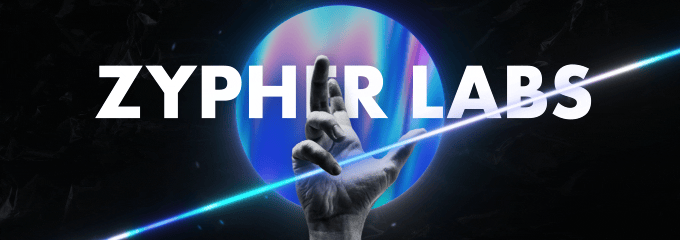

<div align="center">
  
</div>

# 🌟 **Zypher-Labs** 🚀  

**Flipping ideas into reality, one byte at a time.**  
We are a forward-thinking tech organization dedicated to creating innovative solutions, empowering developers, and simplifying complex workflows.  

---

<div align="center">
 <a href="https://git.io/typing-svg"></a>
</div>

---

## ✨ **Our Mission**  

To **transform innovation into impact** by developing cutting-edge tools, fostering a global developer community, and delivering world-class solutions.  

---

## 🏆 **Why Byteflips?**  

- 🌟 **Golden Standards**: Excellence in everything we build.  
- ⚡ **Innovative Culture**: Passionate about emerging technologies.  
- 🌍 **Global Impact**: Tools and solutions that redefine possibilities.  

---

## 📂 **Our Projects**  

| Project Name         | Description                           | Status 🚦 |
|----------------------|---------------------------------------|----------|
| **Zypher-panel**        | All-in-one server management solution | ⚙️ In development |
| **Zypher-Client**        | Minecraft PvP Client | ⚙️ Discontinued |
| **Skyport-Reimagened**        | Skyport Next-Gen | ⚙️ In development |


Explore more in our **[repositories](https://github.com/Zypher-Labs)**.

---

## 🛠️ **Tech Stack We Use**  

```plaintext
Languages  : JavaScript, TypeScript, Python, PHP
Frameworks : Node.js, React, Tailwind CSS, Express.js
Tools      : Docker, PM2
Cloud      : AWS, Firebase, Google Cloud
```
---

## 🌐 Connect With Us  

📬 **Discord**: [Join Server](Discord.gg)  
🌍 **Website**: [hub.Zypher.us.kg](https://hub.Zypher.us.kg)
---
## 🧑‍💻 **Most Used Languages**  

Here are the two languages we use most frequently in our projects:

- : The backbone of our web applications, used for both front-end and back-end development with Node.js, React, and more.
- : A powerful templating engine for embedding JavaScript into HTML, enabling dynamic page rendering with Express.js.
---

> **"At Zypher Labs, we don't just chase innovation, we engineer it."**  
> — **Zypher-labs Team**

---

Crafted with ❤️ by the Zypher-Labs Legends ✨
